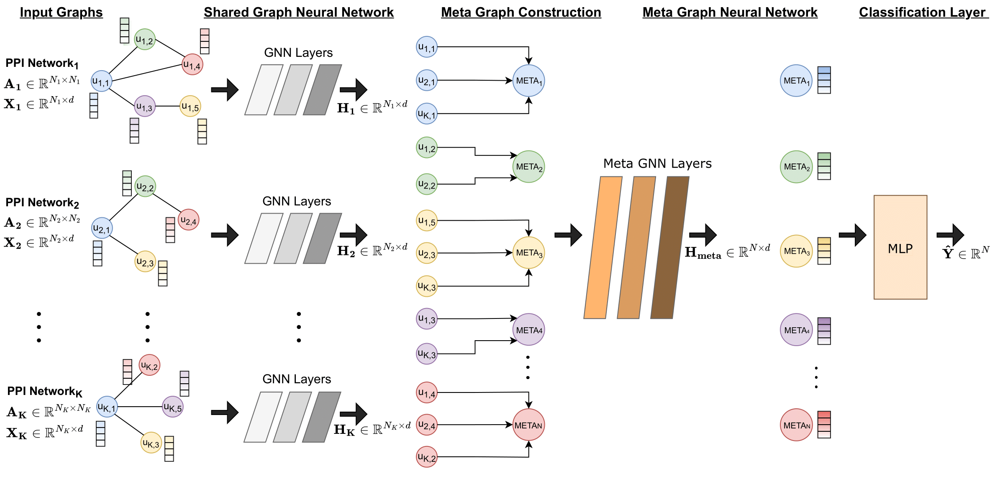

 

# README
The preprint paper associated with this work can be accessed at the following link: https://arxiv.org/abs/2301.08831

This repository contains the scripts for training and explaining the predictions of the EMGNN model.

## Requirements
- Python 3
- PyTorch
- torch-scatter, torch-sparse, torch-cluster, torch-spline-conv, torch-geometric
- networkx
- captum
- pandas
- sklearn

## How to Run

### Data preperation 

To have a fair comparison with EMOGI, we used the same data preprocessing as their official implementation https://github.com/schulter/EMOGI. Follow the instruction to download the PPI networks and the labels.

### Training

To train the model, run the following command:

    python train.py --gcn 1 

This will train the EMGNN model using GCN as the graph neural network with the default settings and the datasets specified in the script. You can also specify different settings and datasets by passing in command-line arguments. For example, to train the model using the GAT architecture on the IREF_2015, PCNET and STRING PPI networks, and test it on STRING you can run:

    python train.py --gat 1 --dataset IREF_2015 PCNET STRING

Notice that the last PPI network will always be used as the test set.

### Explaining Predictions of EMGNN

To run the integradient gradients method for the cancer genes, run the following command:

    python explain.py --model_dir <path_to_trained_model> --gene_label cancer

You can also change the genes to be explained (cancer,non-cancer,top_predicted) and whether to save the visualizations or not (--visualize).
Note: Make sure the path to the trained model is the correct path.

The script also includes additional functionalities such as loading a pretrained model, adding random features, adding identical features, adding structural noise, and running a multi-layer perceptron (MLP) as a baseline instead of the EMGNN. The functionality of these options can be found in the code.

### Predictions for Unlabelled Genes

We provide the predictions for the unlabelled genes of our EMGNN model in the following [link](https://michailchatzianastasis.github.io/csv_to_html/).

